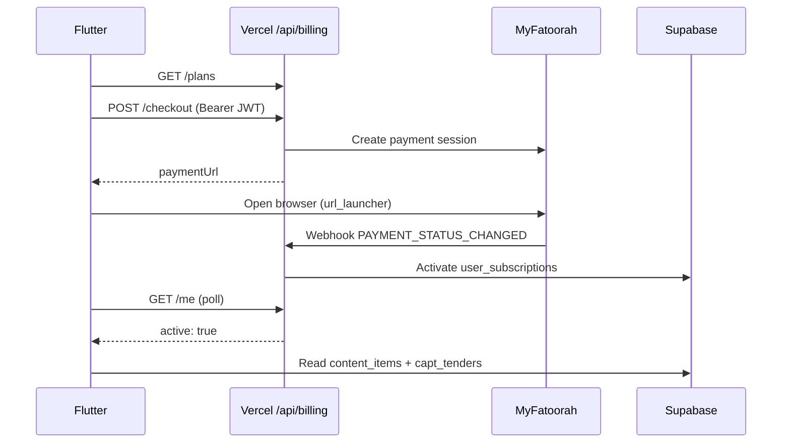

# Flutter: payment flow + latest CAPT tenders tab

Integration guide for **apophenia_flutter** against the admin backend (`https://apophenia-five.vercel.app`) and Supabase project `ixqrfjqhlxpjsbaswcpk`.

**Prerequisites (admin / Supabase):**

- Migrations `012_billing`, `013_billing_lifetime`, `014_capt_tenders` applied
- MyFatoorah keys + webhook on Vercel — see [billing-myfatoorah.md](./billing-myfatoorah.md)
- `FIRECRAWL_API_KEY` on Vercel + daily CAPT sync — see [capt-tenders.md](./capt-tenders.md)

---

## 1. Environment

`.env` or `--dart-define-from-file=.env`:

```env
SUPABASE_URL=https://ixqrfjqhlxpjsbaswcpk.supabase.co
SUPABASE_ANON_KEY=your_anon_or_publishable_key
ADMIN_API_URL=https://apophenia-five.vercel.app
```

| Variable | Required | Purpose |
|----------|----------|---------|
| `SUPABASE_URL` | Yes | Auth + DB |
| `SUPABASE_ANON_KEY` | Yes | Auth + RLS reads |
| `ADMIN_API_URL` | Yes | Billing APIs + mobile chat |

User must be **signed in** (Supabase Auth) for subscriptions, `content_items`, and `capt_tenders`.

---

## 2. Payment / subscription flow

### Architecture



### API endpoints (Vercel)

All billing routes need header:

```http
Authorization: Bearer <supabase_access_token>
Content-Type: application/json
```

| Endpoint | Method | Body | Response |
|----------|--------|------|----------|
| `/api/billing/plans` | GET | — | `{ "plans": [...] }` |
| `/api/billing/me` | GET | — | See below |
| `/api/billing/checkout` | POST | `{ "plan_id": "uuid" }` | `{ "transactionId", "paymentUrl", "sessionId", "invoiceId" }` |

**`GET /api/billing/me` — no subscription:**

```json
{ "active": false, "subscription": null, "days_remaining": 0 }
```

**Active timed plan:**

```json
{
  "active": true,
  "is_lifetime": false,
  "days_remaining": 42,
  "subscription": {
    "id": "...",
    "plan_id": "...",
    "starts_at": "...",
    "expires_at": "...",
    "is_lifetime": false,
    "plan": { "name_ar": "...", "duration_days": 90 }
  }
}
```

**Lifetime plan:** `is_lifetime: true`, `days_remaining: null`.

### Plan fields (`subscription_plans`)

| Field | Type | Notes |
|-------|------|--------|
| `id` | uuid | Pass to checkout |
| `name_ar` | string | Display |
| `name_en` | string? | |
| `description_ar` | string? | |
| `price_kwd` | number | e.g. `15.000` |
| `duration_days` | int? | null if lifetime |
| `is_lifetime` | bool | Show «مدى الحياة» |
| `sort_order` | int | Order in UI |
| `features` | json array | Optional bullets |

### Repository (already in repo)

`lib/features/subscription/data/billing_repository.dart`:

- `fetchPlans()` → `GET $ADMIN_API_URL/api/billing/plans`
- `fetchMyStatus()` → `GET .../api/billing/me`
- `startCheckout(planId)` → `POST .../api/billing/checkout`
- `pollUntilActive()` — polls `/me` every 2s, max 20 attempts

Wire via `billingRepositoryProvider` (`Env.adminApiUrl` required).

### Paywall

`MainShell` checks `billingStatusProvider`:

- Not active → full-screen `SubscriptionScreen(required: true)`
- Active → normal bottom nav

After successful payment, invalidate `billingStatusProvider` and `context.go('/')`.

### Checkout UX (implement / verify)

1. User picks plan on `SubscriptionScreen`.
2. `startCheckout(plan.id)` → open `paymentUrl` with `launchUrl(..., mode: LaunchMode.externalApplication)`.
3. User pays in MyFatoorah (KNET / card).
4. `pollUntilActive()` until `active == true`.
5. On failure / timeout → show `ArKwStrings.billingPendingConfirmation`; allow manual refresh of `billingStatusProvider`.

### Profile entry

`/subscription` route — optional manage screen (same plans + active status). Paywall uses `required: true`.

### Content gating

RLS on `content_items`: only rows where `is_published = true` **and** `has_active_subscription(auth.uid())`.

`/api/mobile-chat` returns **402** `{ "code": "subscription_required" }` without subscription.

---

## 3. Latest CAPT tenders tab (home)

CAPT tenders are synced daily (Firecrawl) into table **`capt_tenders`**. RLS: authenticated users can `SELECT` rows where `status = 'open'`.

### Schema `capt_tenders`

| Column | Type | Notes |
|--------|------|--------|
| `id` | uuid | PK |
| `external_ref` | text | Unique CAPT ref |
| `title_ar` | text | Primary title |
| `title_en` | text? | |
| `ministry_name` | text? | Issuing body |
| `tender_type` | text? | e.g. open tender |
| `published_at` | timestamptz? | |
| `deadline_at` | timestamptz? | Closing date |
| `detail_url` | text? | Open in browser |
| `status` | enum | `open` \| `expired` (app only sees `open`) |
| `is_latest` | bool | Seen in latest sync batch |
| `last_seen_at` | timestamptz | Last sync time |

### Query — latest tenders

Prefer **`is_latest = true`** first; fallback to all open sorted by deadline:

```dart
Future<List<CaptTender>> fetchLatestCaptTenders(SupabaseClient client) async {
  var data = await client
      .from('capt_tenders')
      .select(
        'id, title_ar, title_en, ministry_name, tender_type, '
        'published_at, deadline_at, detail_url, is_latest, last_seen_at',
      )
      .eq('status', 'open')
      .eq('is_latest', true)
      .order('deadline_at', ascending: true);

  final list = data as List;
  if (list.isEmpty) {
    data = await client
        .from('capt_tenders')
        .select(
          'id, title_ar, title_en, ministry_name, tender_type, '
          'published_at, deadline_at, detail_url, is_latest, last_seen_at',
        )
        .eq('status', 'open')
        .order('last_seen_at', ascending: false)
        .limit(50);
  }

  return (data as List)
      .map((e) => CaptTender.fromJson(Map<String, dynamic>.from(e as Map)))
      .toList();
}
```

### Model

```dart
class CaptTender {
  const CaptTender({
    required this.id,
    required this.titleAr,
    this.titleEn,
    this.ministryName,
    this.tenderType,
    this.publishedAt,
    this.deadlineAt,
    this.detailUrl,
    this.isLatest = false,
  });

  final String id;
  final String titleAr;
  final String? titleEn;
  final String? ministryName;
  final String? tenderType;
  final DateTime? publishedAt;
  final DateTime? deadlineAt;
  final String? detailUrl;
  final bool isLatest;

  factory CaptTender.fromJson(Map<String, dynamic> json) {
    DateTime? parse(String? s) =>
        s != null ? DateTime.tryParse(s) : null;
    return CaptTender(
      id: json['id'] as String,
      titleAr: json['title_ar'] as String,
      titleEn: json['title_en'] as String?,
      ministryName: json['ministry_name'] as String?,
      tenderType: json['tender_type'] as String?,
      publishedAt: parse(json['published_at'] as String?),
      deadlineAt: parse(json['deadline_at'] as String?),
      detailUrl: json['detail_url'] as String?,
      isLatest: json['is_latest'] as bool? ?? false,
    );
  }
}
```

Suggested files:

```
lib/features/capt_tenders/
  domain/capt_tender.dart
  data/capt_tenders_repository.dart
  presentation/capt_tenders_providers.dart
  presentation/capt_tender_card.dart
```

### New home tab — «أحدث المناقصات»

Today `HomeScreen` tabs come from `categories` (ministries, addendums, decrees). Add a **virtual tab** that is **not** a DB category.

**Recommended pattern:**

1. Define sentinel id, e.g. `static const kLatestTendersTabId = '__capt_latest__';`
2. Extend `_CategoryBar` labels: `[ ...categories.map(tabLabel), 'أحدث المناقصات' ]`
3. When selected index == categories.length → show CAPT list instead of `homeFeedProvider`
4. Pull-to-refresh → `ref.invalidate(latestCaptTendersProvider)`

**UI sketch:**

```dart
// In HomeScreen build, after loading categories:
final showCaptTab = _selectedCategoryId == kLatestTendersTabId;

if (showCaptTab) {
  final tendersAsync = ref.watch(latestCaptTendersProvider);
  return tendersAsync.when(
    loading: () => ...,
    error: (_, __) => ErrorState(onRetry: () => ref.invalidate(latestCaptTendersProvider)),
    data: (tenders) => ListView.builder(
      itemCount: tenders.length,
      itemBuilder: (_, i) => CaptTenderCard(
        tender: tenders[i],
        onTap: () async {
          final url = tenders[i].detailUrl;
          if (url != null) {
            await launchUrl(Uri.parse(url), mode: LaunchMode.externalApplication);
          }
        },
      ),
    ),
  );
}
// else: existing category feed
```

**Card content:**

- Title: `titleAr`
- Subtitle: `ministryName ?? tenderType`
- Badge: «جديد» if `isLatest`
- Footer: deadline formatted (Arabic locale) or «—»
- Tap → `detail_url` on capt.gov.kw (external browser)

**Strings** (`ar_kw_strings.dart`):

```dart
static const latestTendersTab = 'أحدث المناقصات';
static const noCaptTenders = 'لا توجد مناقصات حالياً';
static const captSource = 'الجهاز المركزي للمناقصات';
static const captDeadline = 'آخر موعد';
```

### Gazette tenders vs CAPT

| Source | Table | Home tab |
|--------|-------|----------|
| Official gazette PDF | `content_items` (`content_type = tender`) | Existing bottom nav **مناقصات** `/tender` |
| CAPT website sync | `capt_tenders` | New home tab **أحدث المناقصات** |

Both require active subscription (RLS).

---

## 4. Provider wiring

```dart
final captTendersRepositoryProvider = Provider<CaptTendersRepository?>((ref) {
  final client = ref.watch(supabaseClientProvider);
  if (client == null) return null;
  return CaptTendersRepository(client);
});

final latestCaptTendersProvider = FutureProvider<List<CaptTender>>((ref) async {
  final repo = ref.watch(captTendersRepositoryProvider);
  if (repo == null) return [];
  return repo.fetchLatest();
});
```

Invalidate `latestCaptTendersProvider` on home pull-to-refresh when CAPT tab is selected.

---

## 5. Checklist

**Billing**

- [ ] `ADMIN_API_URL` set in Flutter env
- [ ] User signs up / signs in (Supabase Auth)
- [ ] Plans load from `/api/billing/plans`
- [ ] Checkout opens MyFatoorah; poll until `active`
- [ ] Paywall clears; home content loads
- [ ] Lifetime plan shows «مدى الحياة» (no day count)

**CAPT tenders**

- [ ] Migration `014_capt_tenders` applied
- [ ] Admin **مناقصات CAPT** sync succeeds (Firecrawl key on Vercel)
- [ ] Flutter query returns rows for subscribed user
- [ ] Home tab **أحدث المناقصات** lists tenders
- [ ] Tap opens `detail_url` in browser

**Test cards (MyFatoorah sandbox)**

Use MyFatoorah test portal credentials configured on Vercel (`MYFATOORAH_BASE_URL=https://apitest.myfatoorah.com`).

---

## 6. Troubleshooting

| Issue | Fix |
|-------|-----|
| Plans empty | Admin → create active plans; check `/api/billing/plans` |
| Checkout 503 | MyFatoorah env vars missing on Vercel |
| Poll never activates | Webhook URL must be Vercel `/api/webhooks/myfatoorah`; check Vercel logs |
| `capt_tenders` empty | Run admin sync; verify `FIRECRAWL_API_KEY` |
| RLS denies read | User must be authenticated + subscription active |
| 401 on billing API | Pass fresh Supabase `session.accessToken` as Bearer |

---

## 7. Related docs

- [flutter-integration.md](./flutter-integration.md) — general app + content feed
- [billing-myfatoorah.md](./billing-myfatoorah.md) — admin billing setup
- [capt-tenders.md](./capt-tenders.md) — Firecrawl sync on admin side
