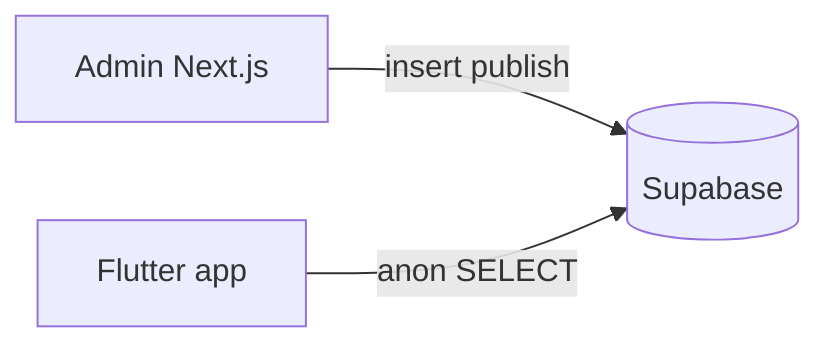

# Flutter app integration (apophinia / كويت اليوم)

Guide for building the **read-only mobile app** that consumes published gazette content from this project’s Supabase backend.

## Overview

| Component | Mobile app uses? | Notes |
|-----------|------------------|--------|
| **Supabase Postgres** | Yes | Primary API via `supabase_flutter` |
| **Supabase Storage** (`assets`) | Yes | Public logos |
| **Supabase Storage** (`gazettes`) | No | Admin-only PDFs |
| **Vercel admin** (`apophenia-five.vercel.app`) | Yes (billing + chat) | `ADMIN_API_URL` — billing and mobile-chat only |

The admin panel uploads PDFs, runs extraction (Inngest), and writes **`content_items`** with `is_published = true`. The Flutter app reads published data **only with an active subscription** (RLS + paywall).

See also: [billing-myfatoorah.md](./billing-myfatoorah.md) · [Flutter billing + CAPT tenders tab](./flutter-billing-and-capt-tenders.md)



---

## Credentials

Use the **same Supabase project** as the admin panel. From `.env.local.example`:

```env
SUPABASE_URL=https://YOUR_PROJECT.supabase.co
SUPABASE_ANON_KEY=your_publishable_or_anon_key
```

**Flutter (`--dart-define` or env file):**

```dart
const supabaseUrl = String.fromEnvironment('SUPABASE_URL');
const supabaseAnonKey = String.fromEnvironment('SUPABASE_ANON_KEY');
```

| Key | Ship in app? |
|-----|----------------|
| `NEXT_PUBLIC_SUPABASE_PUBLISHABLE_KEY` / anon | Yes |
| `SUPABASE_SERVICE_ROLE_KEY` | **Never** |

Initialize:

```dart
await Supabase.initialize(
  url: supabaseUrl,
  anonKey: supabaseAnonKey,
);
final supabase = Supabase.instance.client;
```

---

## Row Level Security (RLS)

| Table | Anon / authenticated read |
|-------|---------------------------|
| `categories` | All rows |
| `ministries` | All rows |
| `tender_categories` | All rows |
| `content_items` | Only `is_published = true` **and** active subscription (`has_active_subscription`) |
| `pdf_issues`, `content_drafts`, `admin_users`, `audit_log` | Denied |

Always add `.eq('is_published', true)` on content queries (defense in depth).

---

## Home tabs (3 categories)

Load tabs from `categories` ordered by `sort_order`:

| `slug` | Arabic | English |
|--------|--------|---------|
| `ministries` | الوزارات | Ministries |
| `addendums` | الاستدراكات | Addendums |
| `decrees` | الأحكام والمراسيم | Judgments and Decrees |

```dart
final res = await supabase
    .from('categories')
    .select()
    .order('sort_order', ascending: true);
```

Default tab: `ministries`. Show a badge on rows where `is_trending == true` (usually `decrees`).

---

## Schema reference

### `content_items` (main feed)

| Column | Type | Notes |
|--------|------|--------|
| `id` | uuid | PK |
| `issue_id` | uuid? | Gazette issue |
| `content_type` | enum | `article`, `tender`, `decree`, `addendum` |
| `category_id` | uuid? | Home tab |
| `ministry_id` | uuid? | Issuing body |
| `tender_category_id` | uuid? | Tender type |
| `title_ar` | text | Required |
| `summary_ar` | text? | List preview |
| `body_ar` | text? | Detail body |
| `slug` | text | Unique |
| `search_text` | text? | Search index |
| `tags` | text[]? | |
| `source_name` | text? | Default `كويت اليوم` |
| `source_logo_url` | text? | URL or storage path |
| `is_featured` | bool | Carousel |
| `is_published` | bool | Must be `true` in app |
| `published_at` | timestamptz? | Sort key |
| `deadline_at` | timestamptz? | Tenders |
| `application_url` | text? | External link |
| `page_start`, `page_end` | int? | PDF pages |
| `created_at`, `updated_at` | timestamptz | |

### `categories`

`id`, `name_ar`, `name_en`, `slug`, `sort_order`, `badge_emoji`, `is_trending`, `created_at`

### `ministries`

`id`, `name_ar`, `name_en`, `slug`, `logo_url`, `created_at`  
Optional (migration `007`): `last_seen_at`, `source` (`pdf` | `manual` | `canonical`)

### `tender_categories`

`id`, `name_ar`, `name_en`, `slug`, `sort_order`, `created_at`  
Optional: `last_seen_at`, `source`

---

## Supabase queries

### Feed (paginated)

```dart
Future<List<Map<String, dynamic>>> fetchFeed({
  required String categoryId,
  int page = 0,
  int pageSize = 20,
}) async {
  final from = page * pageSize;
  final to = from + pageSize - 1;

  return await supabase
      .from('content_items')
      .select('''
        *,
        category:categories(id, name_ar, slug),
        ministry:ministries(id, name_ar, logo_url),
        tender_category:tender_categories(id, name_ar)
      ''')
      .eq('is_published', true)
      .eq('category_id', categoryId)
      .order('published_at', ascending: false)
      .range(from, to);
}
```

### Featured carousel

```dart
await supabase
    .from('content_items')
    .select('*, ministry:ministries(name_ar, logo_url)')
    .eq('is_published', true)
    .eq('is_featured', true)
    .order('published_at', ascending: false)
    .limit(10);
```

### Detail

```dart
await supabase
    .from('content_items')
    .select('''
      *,
      category:categories(*),
      ministry:ministries(*),
      tender_category:tender_categories(*)
    ''')
    .eq('is_published', true)
    .eq('id', itemId)
    .maybeSingle();
```

### Search (Arabic)

```dart
await supabase
    .from('content_items')
    .select('id, title_ar, summary_ar, published_at, content_type, category:categories(slug)')
    .eq('is_published', true)
    .or('title_ar.ilike.%$query%,summary_ar.ilike.%$query%')
    .order('published_at', ascending: false)
    .limit(30);
```

### Filter by ministry

```dart
.eq('ministry_id', ministryId)
```

### Tenders only

```dart
.eq('content_type', 'tender')
```

Use `deadline_at` for display and `url_launcher` on `application_url`.

### Ministries list (filters)

```dart
await supabase.from('ministries').select().order('name_ar');
```

### Storage logos

```dart
String resolveLogoUrl(String? pathOrUrl) {
  if (pathOrUrl == null || pathOrUrl.isEmpty) return '';
  if (pathOrUrl.startsWith('http')) return pathOrUrl;
  return supabase.storage.from('assets').getPublicUrl(pathOrUrl);
}
```

---

## Content type labels (UI)

| `content_type` | Arabic label |
|----------------|--------------|
| `article` | خبر |
| `tender` | مناقصة |
| `decree` | مرسوم |
| `addendum` | استدراك |

---

## Dart models (starter)

```dart
enum ContentType { article, tender, decree, addendum }

class Category {
  final String id;
  final String nameAr;
  final String slug;
  final int sortOrder;
  final bool isTrending;

  factory Category.fromJson(Map<String, dynamic> j) => Category(
        id: j['id'] as String,
        nameAr: j['name_ar'] as String,
        slug: j['slug'] as String,
        sortOrder: j['sort_order'] as int,
        isTrending: j['is_trending'] as bool? ?? false,
      );
}

class ContentItem {
  final String id;
  final ContentType contentType;
  final String titleAr;
  final String? summaryAr;
  final String? bodyAr;
  final DateTime? publishedAt;
  final DateTime? deadlineAt;
  final String? applicationUrl;
  final String? sourceName;
  final Ministry? ministry;

  factory ContentItem.fromJson(Map<String, dynamic> j) => ContentItem(
        id: j['id'] as String,
        contentType: ContentType.values.byName(j['content_type'] as String),
        titleAr: j['title_ar'] as String,
        summaryAr: j['summary_ar'] as String?,
        bodyAr: j['body_ar'] as String?,
        publishedAt: j['published_at'] != null
            ? DateTime.parse(j['published_at'] as String)
            : null,
        deadlineAt: j['deadline_at'] != null
            ? DateTime.parse(j['deadline_at'] as String)
            : null,
        applicationUrl: j['application_url'] as String?,
        sourceName: j['source_name'] as String?,
        ministry: j['ministry'] != null
            ? Ministry.fromJson(j['ministry'] as Map<String, dynamic>)
            : null,
      );
}
```

---

## Suggested packages

```yaml
dependencies:
  supabase_flutter: ^2.8.0
  flutter_riverpod: ^2.6.1
  go_router: ^14.0.0
  intl: ^0.19.0
  url_launcher: ^6.3.0
  cached_network_image: ^3.4.0
```

---

## UI requirements

1. **RTL** — `Directionality(textDirection: TextDirection.rtl)`, Arabic font (e.g. Noto Sans Arabic).
2. **3-tab shell** — الوزارات | الاستدراكات | الأحكام والمراسيم.
3. **List row** — `title_ar`, `summary_ar` (max 2 lines), ministry name, `published_at`, type chip.
4. **Detail** — full `body_ar`, source footer (`source_name` / كويت اليوم).
5. **Tender** — deadline + open `application_url` in browser.
6. **Pull-to-refresh** + infinite scroll via `.range()`.
7. **Empty / error** states in Arabic.

---

## Project structure

```
lib/
  main.dart
  core/supabase_client.dart
  models/
  repositories/content_repository.dart
  features/
    home/           # 3 tabs + feed
    article/        # detail
    search/
```

### Repository interface

```dart
abstract class ContentRepository {
  Future<List<Category>> getCategories();
  Future<List<ContentItem>> getFeed({
    required String categoryId,
    int page,
    int limit,
  });
  Future<ContentItem?> getById(String id);
  Future<List<ContentItem>> search(String query);
  Future<List<ContentItem>> getFeatured();
}
```

---

## Realtime (optional)

Refresh feed when new content is published:

```dart
supabase
    .channel('content_items_inserts')
    .onPostgresChanges(
      event: PostgresChangeEvent.insert,
      schema: 'public',
      table: 'content_items',
      callback: (_) => ref.invalidate(feedProvider),
    )
    .subscribe();
```

---

## Subscriptions (MyFatoorah)

See **[billing-myfatoorah.md](./billing-myfatoorah.md)**.

| Endpoint | Auth |
|----------|------|
| `GET /api/billing/plans` | Public |
| `GET /api/billing/me` | Bearer token |
| `POST /api/billing/checkout` | Bearer token — body `{ "plan_id": "uuid" }` |

Flutter opens `paymentUrl` in browser, then polls `/api/billing/me`. Main app shell shows paywall until `active: true`.

---

## AI chat (Vercel API)

The floating home-screen assistant calls the admin backend, **not** OpenAI from the device.

See **[mobile-chat-api.md](./mobile-chat-api.md)** — `POST /api/mobile-chat` with `Authorization: Bearer <supabase_access_token>`.

Requires Flutter **Supabase Auth** (consumer accounts). `OPENAI_API_KEY` lives on Vercel only.

---

## Out of scope (v1)

- Admin login, PDF upload, settings
- `gazettes` bucket / raw PDF
- Writes to any table (except user profile if you add it)

---

## Checklist

- [ ] Supabase migrations `001`–`012` applied on shared project
- [ ] Anon/publishable key in Flutter only (no service role)
- [ ] 3 categories load; feed filtered by `category_id`
- [ ] Only subscribed users see published content (`012_billing` RLS)
- [ ] `ADMIN_API_URL` set; billing paywall + checkout work
- [ ] Detail + tender URL + search work
- [ ] Tested iOS and Android

---

## Related

- Admin setup: [../README.md](../README.md)
- TypeScript types: [../src/lib/types/database.ts](../src/lib/types/database.ts)
- Canonical categories: [../src/lib/reference/canonical-categories.ts](../src/lib/reference/canonical-categories.ts)

**Production admin URL:** https://apophenia-five.vercel.app  
**Repo:** https://github.com/akshaykc222/apophenia
